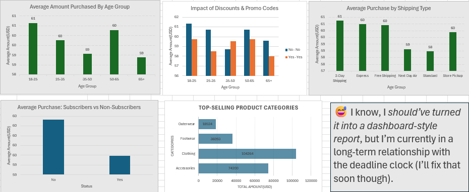

# 📊 Consumer Shopping Behaviour Analysis

---

## 🌟 Table of Contents
1. [Project Overview](#project-overview)
2. [Dataset](#dataset)
3. [Research Questions](#research-questions)
4. [Data Cleaning Summary](#data-cleaning-summary)
5. [Analysis & Visualizations](#analysis--visualizations)
6. [Insights & Conclusions](#insights--conclusions)
7. [Limitations & Future Work](#limitations--future-work)
8. [Project Files](#project-files)
9. [Contact](#contact)

---

## 📝 Project Overview

The purpose of this project was to **analyze consumer shopping behaviour** and uncover meaningful insights that can **drive sales, improve customer experience, and highlight areas** for business improvement from transaction data.  

Key objectives included:

- Cleaning and structuring raw data 🧹  
- Exploring patterns in purchases, discounts, subscriptions, and shipping types 🔍  
- Visualizing trends and comparisons using Excel charts 📊  
- Presenting clear, actionable insights 💡  

The focus was on **storytelling through data**, turning numbers into insights that inform decisions.
---
## 📂 Dataset

- **Name:** Consumer Shopping Behaviour  
- **Source:** [Kaggle Dataset](https://www.kaggle.com/datasets/zeesolver/consumer-behavior-and-shopping-habits-dataset?select=shopping_behavior_updated.csv)  
- **Size:** 3,901 rows × 20 columns  

**Key Features:**
- Customer info: `Customer ID`, `Age`, `Gender`  
- Purchase details: `Item Purchased`, `Category`, `Purchase Amount (USD)`  
- Behaviour metrics: `Discount Applied`, `Promo Code Used`, `Shipping Type`, `Subscription Status`, `Previous Purchases`, `Frequency of Purchases`, `Payment Method`, `Season`, `Review Rating`

**Dataset file:** [shopping_behavior_updated.csv](Data/shopping_behavior_updated.csv) 
---
## ❓ Research Questions

The analysis focused on the following questions:

1. How does **age group** affect average purchase amount? 👶👵  
2. Do **subscribed customers** spend more than non-subscribers? 📨  
3. Which **product category** generates the highest total sales? 👗👟  
4. Do **discounts or promo codes** increase purchase amounts? 💸  
5. Which **shipping type** is preferred by high-value customers? 🚚  

Each question was analyzed using **Excel PivotTables, formulas, and charts**.
---
## 🧹 Data Cleaning Summary

Before analysis, the dataset was cleaned and structured using the following steps:

1️⃣ Handling Missing Data

- Identified blank or missing cells using Excel functions like `COUNTBLANK()`  
- Replaced missing numerical values with **column averages**  
- Filled missing categorical/text values with `"Unknown"` for clarity  
- Ensured all missing entries were accounted for to maintain analysis integrity

2️⃣ Correcting Inconsistent Data

- Standardized text formatting using `PROPER()` to ensure consistency  
- Replaced variations like `"yes"` and `"YES"` with a uniform `"Yes"`  
- Fixed typos and inconsistencies in categories, shipping types, and payment methods using **Find & Replace**

3️⃣ Outlier Detection

- Checked `Purchase Amount (USD)` for extreme values  
- Validated outliers against customer records to confirm accuracy  
- Removed or corrected inaccurate outliers to avoid skewing results

4️⃣ Added Columns for Analysis

- Created an **Age Group** column to categorize customers:
  - 18-25, 25-35, 35-50, 50-65, 65+  
- Enabled comparative analysis across age segments

**Tools/Techniques:** Excel formulas (`COUNTBLANK`, `TRIM`, `PROPER`, `IF`), PivotTables, Charts, and manual Find & Replace.
---
## 📊 Analysis & Visualizations

The following visual summarizes the key findings from the dataset, including:

- Average purchase by age group  
- Subscribers vs Non-subscribers spending  
- Total sales by product category  
- Impact of discounts and promo codes  
- Average purchase by shipping type  

**Insight Highlights:**  
- Average spending is fairly consistent across age groups (~$60)  
- Subscribers spend slightly less than non-subscribers  
- Clothing and Accessories generate the highest total sales  
- Promotions have a positive impact on purchase amounts  
- 2-Day Shipping shows slightly higher purchase averages, suggesting convenience matters  

**Business Implication:**  
- Focus on high-performing product categories for marketing  
- Use targeted promotions to boost sales  
- Offer convenient shipping options to enhance customer satisfaction
---
## 💡 Insights & Conclusions

From the analysis, we can draw several key takeaways:

- **Consistent Spending Across Age Groups:** Average purchase amounts (~$60) do not vary significantly across age groups.  
- **Subscription Status:** Subscribers spend slightly less than non-subscribers, indicating a potential opportunity to incentivize subscriptions.  
- **Top-Selling Categories:** Clothing and Accessories are the highest revenue-generating categories.  
- **Promotions & Discounts:** Applying discounts or promo codes slightly increases purchase amounts, showing effectiveness in encouraging purchases.  
- **Shipping Preferences:** 2-Day Shipping customers have slightly higher average purchase amounts, suggesting convenience influences spending.

**Business Implications:**  
- Focus marketing campaigns on **high-performing product categories**  
- Optimize **promotional strategies** to boost sales and repeat purchases  
- Consider **shipping options** that improve customer convenience and satisfaction
---
## 💡 Insights & Conclusions

From the analysis, we can draw several key takeaways:

- **Consistent Spending Across Age Groups:** Average purchase amounts (~$60) do not vary significantly across age groups.  
- **Subscription Status:** Subscribers spend slightly less than non-subscribers, indicating a potential opportunity to incentivize subscriptions.  
- **Top-Selling Categories:** Clothing and Accessories are the highest revenue-generating categories.  
- **Promotions & Discounts:** Applying discounts or promo codes slightly increases purchase amounts, showing effectiveness in encouraging purchases.  
- **Shipping Preferences:** 2-Day Shipping customers have slightly higher average purchase amounts, suggesting convenience influences spending.

**Business Implications:**  
- Focus marketing campaigns on **high-performing product categories**  
- Optimize **promotional strategies** to boost sales and repeat purchases  
- Consider **shipping options** that improve customer convenience and satisfaction
---
## ⚠️ Limitations & Future Work

**Limitations:**  
- Dataset is **limited in size**; results may not represent all customer behavior  
- **No timeline data**; trends over time cannot be analyzed  
- Some records are **incomplete**, which could introduce bias  

**Future Work:**  
- Collect more data across **different time periods** to analyze trends  
- Integrate additional variables such as **income level, marketing spend, or seasonal effects**  
- Use **visualization tools like Power BI or Tableau** for dynamic dashboards  
- Explore **predictive analytics** to forecast customer behavior and optimize strategies
---
## 📂 Project Files

All relevant files are included in this repository:

- **Slides PowerPoint:** [Stage0_Project_Slides.pptx].(Consumer Shopping Behaviour Analysis.pptx)  
- **Dataset CSV:** [shopping_behavior_updated.csv](Data/shopping_behavior_updated.csv)  
- **Summary Screenshot:** [analysis_summary.png](Dashboard.png)
---
## 👤 Author

- Name: Lawal Mayowa Bryant
- GitHub: [KNGBRYANT](https://github.com/KNGBRYANT?tab=repositories)  
- LinkedIn: [Lawal Mayowa](https://www.linkedin.com/in/lawal-mayowa-160bb930b/)  

